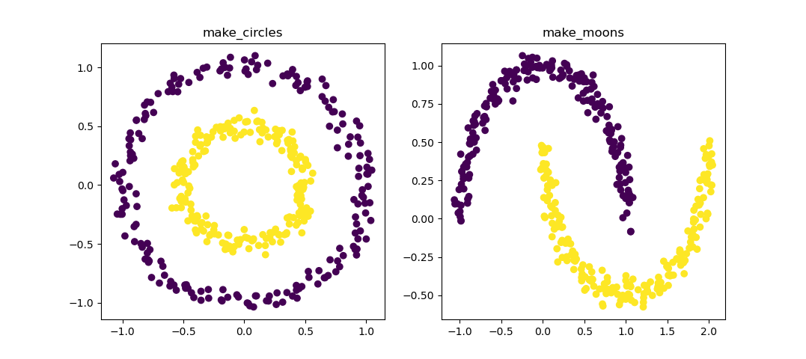
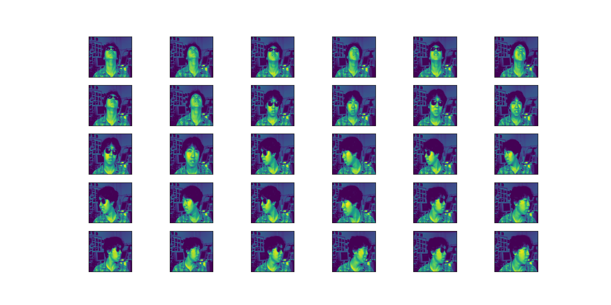
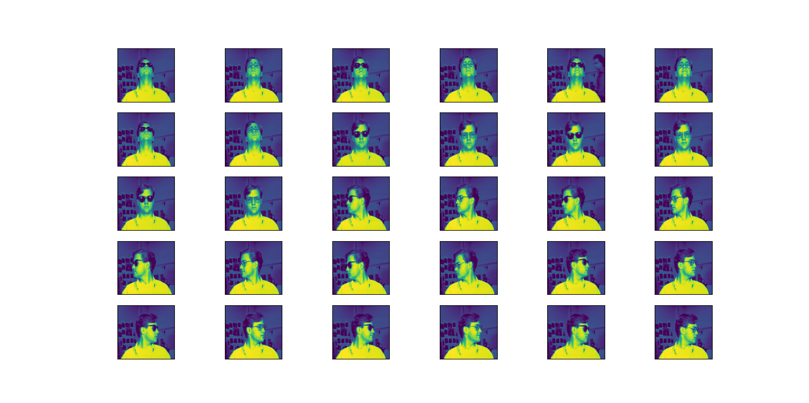

## obj1_1:数据可视化
code:
```
###object1.1:sklearn.datasets.make_circle and sklearn.datasets.make_moons

import sklearn.datasets
import matplotlib.pyplot as plt  
import numpy as np  

fig=plt.figure(1)  
x1,y1=sklearn.datasets.make_circles(n_samples=400,factor=0.5,noise=0.05)
# 生成圆圈形状的二维数据集.factor：里圈和外圈的距离之比；n_samples：总点数

plt.subplot(121)
plt.title('make_circles')
plt.scatter(x1[:,0],x1[:,1],c=y1) #画图

plt.subplot(122)
x1,y1=sklearn.datasets.make_moons(n_samples=400,noise=0.05)
# 生成双月牙形状的二维数据集；n_samples：总点数

plt.title('make_moons')
plt.scatter(x1[:,0],x1[:,1],c=y1) #画图

plt.show() 
```
result:


##obj1_2:图片拼接
```
import numpy as np
import matplotlib.pyplot as plt
import os

def readpgm(name):##读取P2格式的pgm文件
    print(name)
    with open(name) as f:
        lines = f.readlines()

    for l in list(lines):
        if l[0] == '#':
            lines.remove(1)

    # make sure it is ASCII format (P2)
    assert lines[0].strip() == 'P2'

    # 将数据转换为整数列表
    data = []
    for line in lines[1:]:
        data.extend([int(c) for c in line.split()]) #读取数据

    return (np.array(data[3:]),data[1],data[0],data[2])


# data = readpgm('D:\Course\机器学习\MachineLearning-FZU\ch1\\faces\\faces\\faces\\an2i\\'+'an2i_left_angry_open.pgm')

image_dir = 'D:\Course\机器学习\MachineLearning-FZU\ch1\\faces\\faces\\faces\\bpm'
image_filenames = []
for x in os.listdir(image_dir):##获取文件索引list
    path = image_dir+'\\'+x
    image_filenames.insert(0,path)

a=1
for image_filename in image_filenames:##拼接文件
    data = readpgm(image_filename)
    plt.subplot(5,6,a)
    a=a+1
    plt.imshow(data[0].reshape(120,128))
    plt.xticks([])
    plt.yticks([])

plt.show()
```
dataset1:

dataset2:
